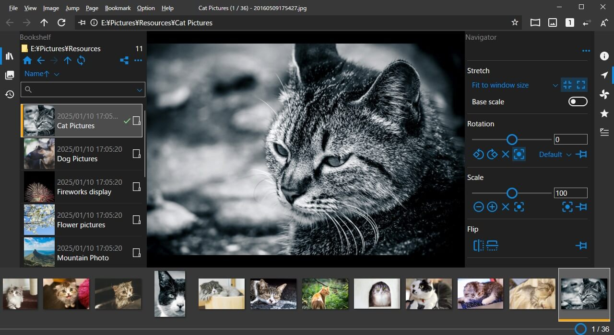

#  NeeView

**[NeeView Portal Site (English/日本語)](https://neelabo.github.io/NeeView)**

### Screenshot

## Description

An image viewer that allows you to browse images in folders and compressed files like a book.
Powerful customization is available.

- Supported image format (bmp, jpg, gif, tiff, png, ico, WIC images)
- Compressed file support (zip, rar, 7z, lzh, cbr, cbz, cb7, ...)
- Recursive compressed file support
- PDF support
- Video play support
- Touch operation supported
- Mouse gesture supported
- Key customization, gesture setting
- Movement, rotation, scaling by dragging
- Loupe mode
- Facing mode
- Full screen mode
- Slide show
- Susie plugin support
- Image drop from web browser
- Command extension by scripts

### System Requirements

* Windows 10 64bit or higher

## Download

- [GitHub Releases](https://github.com/neelabo/NeeView/releases)
- [Microsoft Store](https://www.microsoft.com/store/apps/9p24z53hc1jr)
- [Vector](https://www.vector.co.jp/soft/winnt/art/se512262.html)

## Development Environment

* VisualStudio 2022
    -  .NET Desktop Development
    - Desktop development in C++

## Development of Language Files

- [Development of Language Files](NeeView/Languages)

## Branching Strategy

### master

This is the main development branch. Basically, pull requests are accepted here.

### version-XX

Branches of each major version.
When development of the next major version begins on the master branch, a branch is created to maintain the current major version.

### feature-XX

Branches for feature development.
It will be removed when merged into the master branch.
These branches are working branches and are not guaranteed in any way.

## Versioning Strategy

> MAJOR  . MINOR . BUILD

Update the MAJOR version with any feature additions or changes.

If there are no changes in functionality, such as bug fixes, the MINOR version will be updated.

The BUILD version is automatically assigned the number of commits up to that revision. It is internal and not public.
