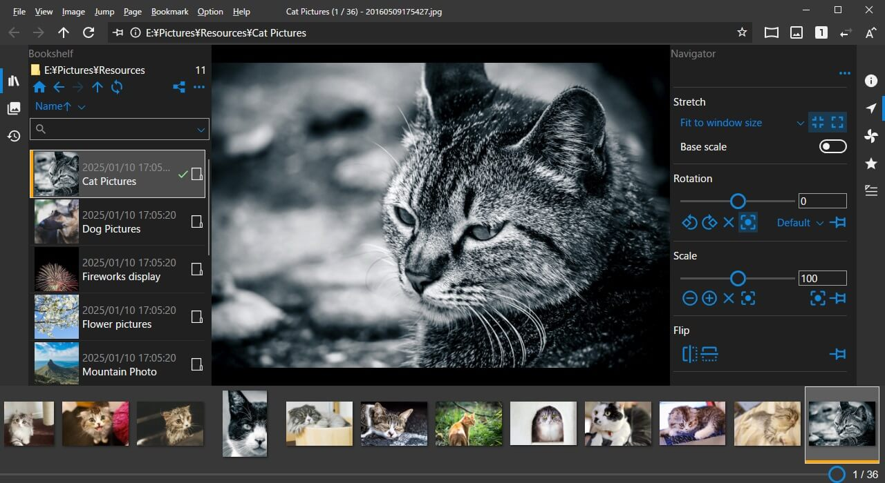

--- 
title: ГЛАВНАЯ
permalink: /ru-ru/index.html
---

<!-- section: overview -->

## Описание

Просмотрщик изображений, позволяющий просматривать изображения в папках и сжатых архивах, как книгу.
Доступны широкие возможности кастомизации.

- Поддержка форматов изображений (bmp, jpg, gif, tiff, png, ico, WIC изображения)
- Поддержка сжатых архивов (zip, rar, 7z, lzh, cbr, cbz, cb7, ...)
- Поддержка рекурсивных (вложенных) архивов
- Поддержка PDF документов
- Воспроизведение видеофайлов
- Поддержка сенсорного управления (Touch)
- Поддержка жестов мыши
- Настройка клавиш и жестов
- Перемещение, поворот и масштабирование перетаскиванием
- Режим лупы (Loupe)
- Двухстраничный режим / разворот
- Полноэкранный режим
- Слайд-шоу
- Поддержка плагинов Susie
- Перетаскивание (drop) изображений из веб-браузера
- Расширение команд с помощью скриптов

### Системные требования

* Windows 10 64-bit или новее

<!-- end_section: overview -->

## Скачать

- [GitHub Releases](https://github.com/neelabo/NeeView/releases)
- [Microsoft Store](https://www.microsoft.com/store/apps/9p24z53hc1jr)
- [Vector](https://www.vector.co.jp/soft/winnt/art/se512262.html)

#### Типы пакетов

* [О версии ZIP](package-zip.md)
* [О версии ZIP-fd](package-zip-fd.md)
* [О версии с инсталлятором](package-installer.md)
* [О версии для Store App](package-storeapp.md)
* [О версии Alpha](package-alpha.md)
* [О версии Beta](package-beta.md)

#### История изменений

 * [История изменений](changelog.md)

## Документация

 * [Руководство пользователя](userguide.md)
 * [Параметры командной строки](commandline-options.md)
 * [Файл настроек приложения](appsettings.md)
 * [Переменные окружения](environment-value.md)
 * [Главное меню](main-menu.html)
 * [Список команд](command-list.html)
 * [Параметры поиска](search-options.html)
 * [Руководство по скриптам](script-manual.html)
 * [Спецификация файлов тем](theme.md)
 * [Вопросы и ответы (Q&A)](question-and-answer.md)
 * [Политика конфиденциальности](privacy-policy.md)
 * [Контакты](contact.md)
